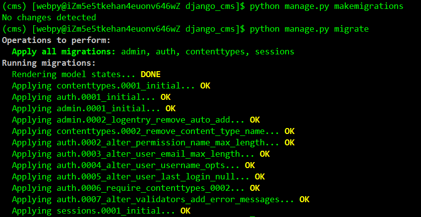
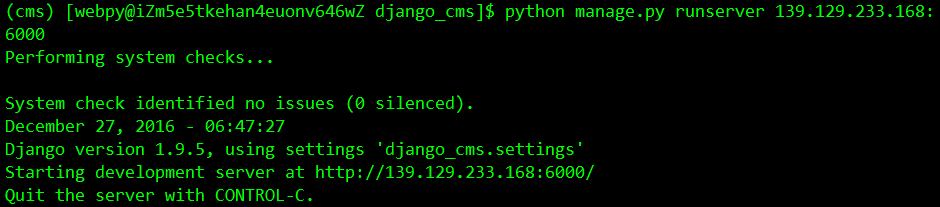
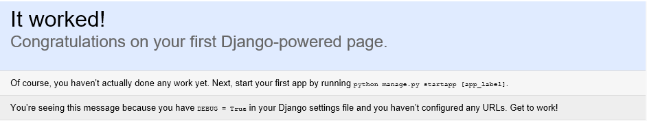

## 一、部署Python3.4相关的开发环境，

#### 1. 创建cms虚拟环境：

    $ source /usr/local/python34/bin/virtualenvwrapper.sh
    $ mkvirtualenv cms
    $ workon cms

#### 2. 使用pip安装如下环境：

    (cms) [webpy@iZm5e5tkehan4euonv646wZ ~]$ pip freeze list
    Django==1.9.5
    Markdown==2.6.6
    djangorestframework==3.3.3
    django-guardian==1.4.4
    django-crispy-forms==1.6.0
    django-filter==0.13.0
    ipython==4.1.2
    httpie==0.9.3
    coreapi==2.1.1

把以上列出的包名存储到package.txt文件中，然后在你的Python虚拟环境中执行安装。

    (cms) [webpy@iZm5e5tkehan4euonv646wZ ~]$ pip install -r package.txt

## 二、创建django项目 [django_cms](https://github.com/changdapeng/django_cms)

#### 1. 创建django项目 django_cms：

    $ django-admin startproject django_cms

#### 2. 目录解析：

    $ tree
    .
    ├── django_cms         # 项目设置目录
    │   ├── __init__.py    # 空的脚本，告诉Python编译器这是一个Python包
    │   ├── settings.py    # 用来存储Django的项目设置的文件
    │   ├── urls.py        # 用来存储项目里的URL模式
    │   └── wsgi.py        # 帮助你运行开发服务，同时可以帮助部署你的生产环境。
    ├── manage.py          # 提供了一系列的Django命令，开发时常用
    └── README.md

    1 directory, 6 files

#### 3. 生成相关数据表

    $ python manage.py makemigrations   # 记录数据模型前后变化
    $ python manage.py migrate          # 根据makemigrations记录的数据模型变化文件再次更新数据表

#### 4. 启动项目，默认使用端口8000，此处我们指定端口：

    $ python manage.py runserver 139.129.233.168:6000

## 三、Django REST framework 环境准备：

#### 1. [Django REST framework](http://www.django-rest-framework.org/)  环境要求：

** REST framework 需要以下环境： **

+ Python (2.7, 3.2, 3.3, 3.4, 3.5)
+ Django (1.8, 1.9, 1.10)

** 下面这些安装包是可选的： ** （此处的包，我们在上步的环境安装中都已安装）

+ [coreapi](https://pypi.python.org/pypi/coreapi/) (1.32.0+) - Schema generation support.
+ [Markdown](https://pypi.python.org/pypi/Markdown/) (2.1.0+) - Markdown support for the browsable API.
+ [django-filter](https://pypi.python.org/pypi/django-filter) (0.9.2+) - Filtering support.
+ [django-crispy-forms](https://github.com/django-crispy-forms/django-crispy-forms) - Improved HTML display for filtering.
+ [django-guardian](https://github.com/django-guardian/django-guardian) (1.1.1+) - Object level permissions support.

